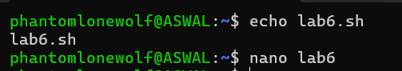

Write shell scripts to print system information.
Write shell script to perform basic mathematical calculation.
Use redirection operators to store the output of commands.

Write shell scripts to print system information ----

Write shell script to perform basic mathematical calculation ----

